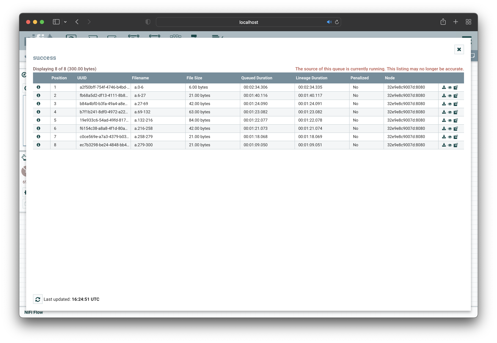

# Apache NiFi

Apache NiFi 는 미국 국가안보국 NSA 가 Apache 재단에 기증한 Dataflow 엔진이다. 
NiFi 는 시스템 간 데이터 전달을 효율적으로 처리, 관리, 모니터링하기 위한 최적의 시스템이다. 대량의 데이터를 수집, 처리하기 위해 만들어졌다.

NiFi 의 특징으로는 
<sub>(1)</sub> GUI 를 제공하여 Dataflow 를 쉽게 개발하고 시스템 간의 데이터 이동 내용을 볼 수 있다는 점,
<sub>(2)</sub> Multi-tenant; 여러 조직이 자원을 공유해서 사용하는 기능을 지원하는 점,
<sub>(3)</sub> 데이터 출처를 추적할 수 있다는 점 
등.. 이있다.

NiFi는 FBP <sub>Flow Based Programming</sub> 의 개념을 구현했으며,

## Nifii 구성요소

NiFi 에서 쓰이는 용어에는 <code>FlowFile</code>, <code>FlowFile Processor</code>, <code>Connection</code>, <code>Flow Controller</code>, <code>ProcessGroup</code> 등.. 이 존재한다.
이에 대한 설명은 아래와 같다

| NiFi | FBP | Description |
|:---:|:---:|:---:|
| FlowFile | Information Packet | NiFi 에서 데이터를 표현하는 객체; Key-Value 형태이며, 이를 통해서 여러 시스템 간의 데이터 이동이 가능 |
| FlowFile Processor | Black Box | FlowFile 은 여러 단계를 거쳐 변경된다. 이때 사용되는 것이 FlowFile Processor 이다. |
| Connection | Bounded Buffer | Processor 간 연결을 말한다. Queueing, Routing, BackPressure, 우선순위 제어, Monitoring 등.. 을 제공 |
| Flow Controller | Scheduler | Processor 의 실행 간격, 시점 등.. 스케줄링을 담당한다. |
| Process Group | Subnet | 여러 단위로 Processor 를 묶을 수 있으며, Group 간의 데이터 이동이 가능하다. |

## Architecture


NiFi 는 위 사진과 같이 설계되어 있다.

1. Web Server   
앞서 설명함과 같이 NiFi 는 UI 를 제공한다. Web Server 에서 제공하는 UI System 을 통해 DataFlow 를 개발, 제어, 모니터링이 가능하다.

2. Flow Controller   
NiFi 의 Scheduling 을 담당한다.

3. Extension   
NiFi 가 제공하는 기본 Processor 외, 개발자가 프로세스를 개발해 확장이 가능하다. 

4. FlowFile Repository   
데이터 선행 기입 (Write-Ahead-Log) 방식으로 FlowFile 을 저장한다. 일반적으로 Raid 10 으로 디스크를 구성한다. 시스템 장애 시 데이터가 유실되지 않도록 주의해야한다. 

5. Content Repository   
FlowFile 가 저장되며, 이 또한 Raid 10 구성이 일반적이다. 

6. Provenance Repository
데이터의 처리 단계별로 데이터를 보관한다. 각 데이터는 인덱스 되어 검색가능하다.

7. FlowFile, Processor
NiFi의 핵심 컴포넌트이다. FlowFile은 Processor에 의해 생성되며, FlowFile은 속성 정보와 데이터가 들어있다.

* ref : <https://www.popit.kr/apache-nifi-overview-and-install/>

## Nifi 사용해보기

```yaml
version: "3"
services:
    zookeeper:
        hostname: zookeeper
        container_name: zookeeper
        image: 'zookeeper'
        environment:
            - ALLOW_ANONYMOUS_LOGIN=yes
        networks:
            - nifinet

    nifi:
        image: apache/nifi:1.11.4
        ports:
            - 8080:8080
        networks:
            - nifinet
        environment:
            - NIFI_WEB_HTTP_PORT=8080
            - NIFI_CLUSTER_IS_NODE=true
            - NIFI_CLUSTER_NODE_PROTOCOL_PORT=8082
            - NIFI_ZK_CONNECT_STRING=zookeeper:2181
            - NIFI_ELECTION_MAX_WAIT=1 min

networks:
    nifinet:
        driver: bridge
```
다음과 같이 <code>docker-compose.yaml</code> 을 작성하여 환경을 구성하였다. 
* ref : <https://taaewoo.tistory.com/41?category=898173>

``` sh 
> docker-compose up -d
```
다음 명령어를 통해 container 를 생성하면 <localhost:8080/nifi> url 로 접속이 가능해진다.   
해당 url 로 접속하게되면 다음과 같은 화면이 뜬다.


상단의 아이콘을 workspace 에 Drag & Drop 을 함으로써 Processor, Input, Output 등.. 을 추가할 수 있다.


Drag & Drop 으로 Processor 를 추가하게 되면 다음과 같이 Processor 의 종류를 선택할 수 있다. 


이렇게 생성된 Processor 위에 커서를 두면 연결을 의미하는 아이콘이 발생한다. 아이콘을 드래그 함으로써 아래와 서로 연결을 시켜줄 수 있다.

이렇게 연결이 생성되면 대기 Queue 와 log 를 확인 할 수 있다.



또한 이런 Processor 는 화면 왼쪽 중단에 Operate 이란 작은 창에서 실행, 종료, 삭제 등.. 여러가지 일을 클릭만으로 손쉽게 관리할 수 있다.